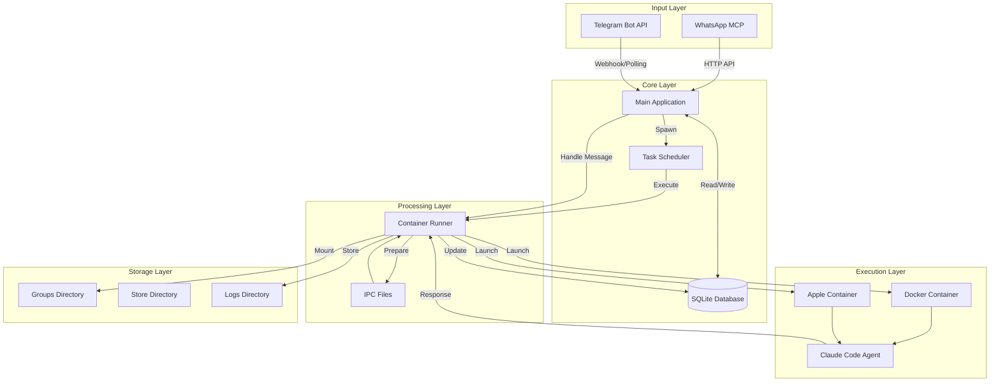
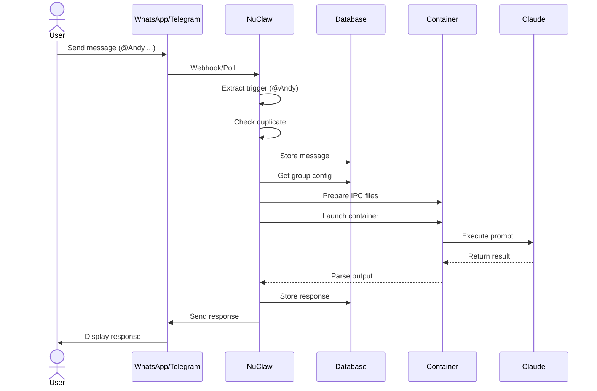
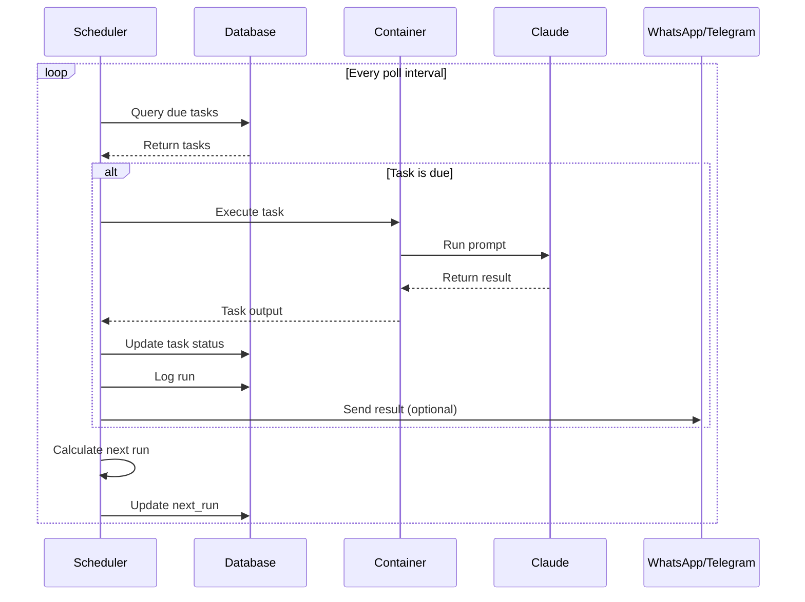

<div align="center">
  
</div>

# NuClaw - Personal Claude Assistant

A Rust implementation of NanoClaw - a personal Claude assistant that runs securely in isolated containers.

English | [简体中文](README_CN.md)

[](https://www.rust-lang.org)
[](LICENSE)
[](https://github.com/gyc567/nuclaw/actions)
[](docs/TEST_REPORT.md)

## Why Rust?

This project is a complete rewrite of [NanoClaw](https://github.com/gavrielc/nanoclaw) in Rust for:
- **Performance** - Faster startup and lower memory usage
- **Safety** - Memory safety and thread safety guarantees
- **Concurrency** - Better async handling for I/O operations

## Features

- **WhatsApp I/O** - Message Claude from your phone
- **Telegram I/O** - Message Claude from Telegram
- **Isolated group context** - Each group has its own memory and filesystem
- **Container isolation** - Agents run in Docker or Apple Container
- **Scheduled tasks** - Recurring jobs with cron expressions
- **Mount allowlist** - Secure additional mount validation

## Architecture

```
WhatsApp / Telegram → SQLite → Scheduler → Container (Claude Agent SDK) → Response
```

### System Architecture



### Message Flow



### Scheduled Task Flow



### Core Components

- `src/main.rs` - Application entry point
- `src/whatsapp.rs` - WhatsApp connection (via MCP)
- `src/telegram.rs` - Telegram Bot API connection
- `src/container_runner.rs` - Container management
- `src/task_scheduler.rs` - Scheduled task execution
- `src/db.rs` - SQLite database operations
- `src/config.rs` - Configuration management

## Requirements

- Rust 1.70+
- Docker or Apple Container
- Node.js (for agent execution)
- Claude Code subscription

## One-Click Installation

### Linux/macOS

```bash
# Run the deployment script
curl -sSL https://raw.githubusercontent.com/gyc567/nuclaw/main/deploy.sh | bash
```

### Local Installation

```bash
# Clone and run deployment
git clone https://github.com/gyc567/nuclaw.git
cd nuclaw
chmod +x deploy.sh
./deploy.sh
```

The script will:
1. Detect your operating system
2. Install Rust/Cargo if needed
3. Install system dependencies (sqlite3)
4. Build the project in release mode
5. Run all tests
6. Verify installation

## Manual Installation

```bash
# Build from source
git clone https://github.com/gyc567/nuclaw.git
cd nuclaw

# Create directories
mkdir -p store data groups logs

# Build
cargo build --release

# Verify
./target/release/nuclaw --help
```

## Quick Start

```bash
# Build
cargo build --release

# Run with WhatsApp authentication
cargo run -- auth

# Start the service
cargo run
```

## Configuration

### Core Environment Variables

| Variable | Default | Description |
|----------|---------|-------------|
| `ASSISTANT_NAME` | Andy | Trigger word for mentions |
| `CONTAINER_TIMEOUT` | 300000 | Agent execution timeout (ms) |
| `TZ` | UTC | Timezone for scheduled tasks |
| `CONTAINER_IMAGE` | anthropic/claude-code:latest | Docker image |

### WhatsApp Configuration

| Variable | Description |
|----------|-------------|
| `WHATSAPP_MCP_URL` | WhatsApp MCP Server URL (required) |

### Telegram Configuration

| Variable | Default | Description |
|----------|---------|-------------|
| `TELEGRAM_BOT_TOKEN` | - | BotFather token (required) |
| `TELEGRAM_WEBHOOK_URL` | - | Webhook URL (optional) |
| `TELEGRAM_WEBHOOK_PATH` | telegram-webhook | Webhook path |
| `TELEGRAM_DM_POLICY` | pairing | DM policy: pairing/allowlist/open/disabled |
| `TELEGRAM_GROUP_POLICY` | allowlist | Group policy: open/allowlist/disabled |
| `TELEGRAM_TEXT_CHUNK_LIMIT` | 4000 | Max text chunk size |
| `TELEGRAM_WHITELIST_GROUPS` | - | Comma-separated group IDs |

## Mount Allowlist

Additional mounts are configured in `~/.config/nuclaw/mount-allowlist.json`:

```json
{
  "allowedRoots": [
    {
      "path": "~/projects",
      "allowReadWrite": true,
      "description": "Development projects"
    }
  ],
  "blockedPatterns": ["password", "secret"],
  "nonMainReadOnly": true
}
```

## Telegram Setup

### Step 1: Create a Bot

1. Open Telegram and search for @BotFather
2. Send `/newbot` to create a new bot
3. Follow the instructions to get your bot token

### Step 2: Configure Environment

```bash
export TELEGRAM_BOT_TOKEN=your_bot_token_here
export TELEGRAM_WEBHOOK_URL=https://your-domain.com  # Optional, for webhook mode
```

### Step 3: Run the Bot

```bash
# Run with Telegram mode
./target/release/nuclaw --telegram
```

### DM Policy Options

- **pairing** - Users must use a pairing code (default)
- **allowlist** - Only whitelisted users can interact
- **open** - Anyone can interact
- **disabled** - Disable DM entirely

### Group Policy Options

- **open** - Any group can use the bot
- **allowlist** - Only whitelisted groups can use the bot
- **disabled** - Disable group functionality

## WhatsApp Setup

```bash
# Configure WhatsApp MCP Server URL
export WHATSAPP_MCP_URL=http://localhost:3000

# Run authentication flow
./target/release/nuclaw --auth

# Start WhatsApp bot
./target/release/nuclaw --whatsapp
```

## Development

```bash
# Run with debug logging
LOG_LEVEL=debug cargo run

# Run tests
cargo test

# Check code
cargo clippy
```

## Project Structure

```
nuclaw/
├── src/              # Source code
├── docs/             # Documentation and reports
│   ├── TEST_REPORT.md
│   ├── DEPLOY_TEST_REPORT.md
│   └── plans/        # Roadmap and plans
├── store/            # Database storage
├── data/             # Application data
├── groups/           # Group contexts
└── logs/             # Container logs
```

## Contributing

We welcome contributions! Please see [CONTRIBUTING.md](CONTRIBUTING.md) for details.

## Roadmap

See [ROADMAP.md](ROADMAP.md) for upcoming features and plans.

## Documentation

- [Test Report](docs/TEST_REPORT.md) - Detailed test results
- [Deployment Test Report](docs/DEPLOY_TEST_REPORT.md) - Deployment verification

## License

MIT
