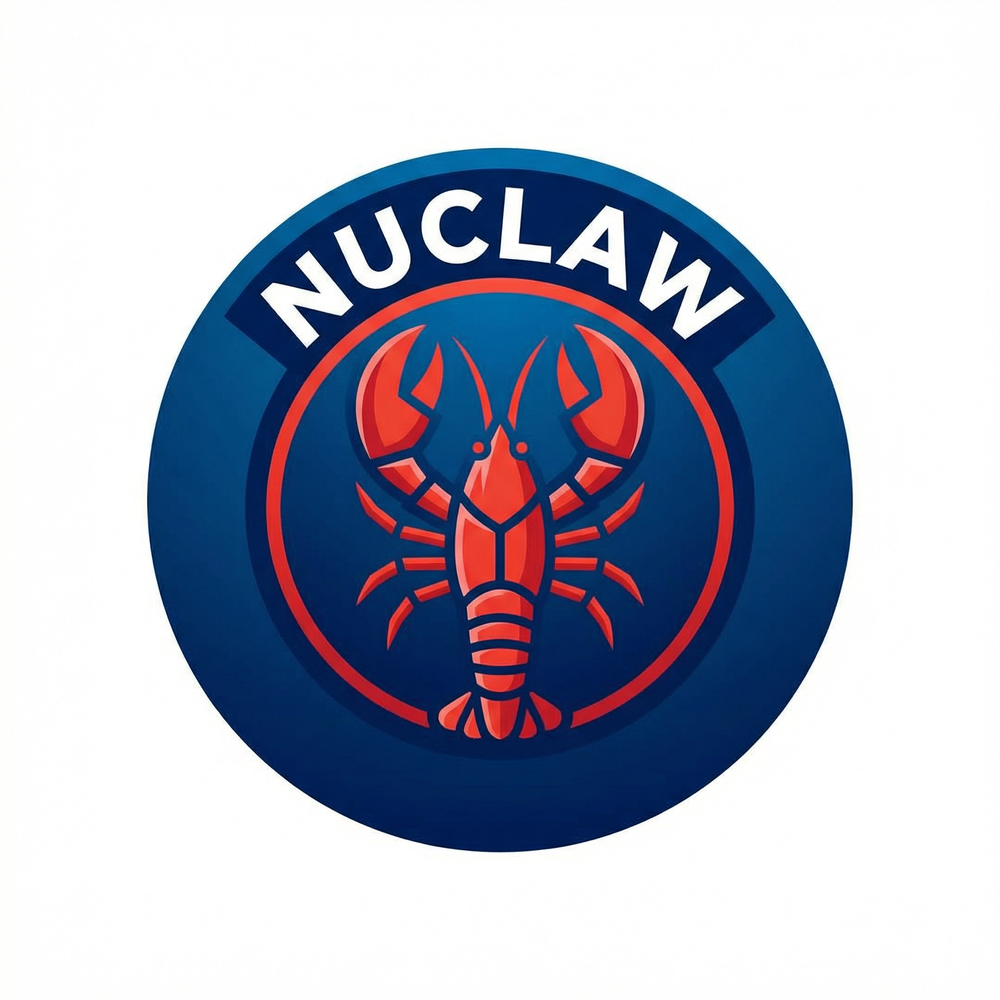
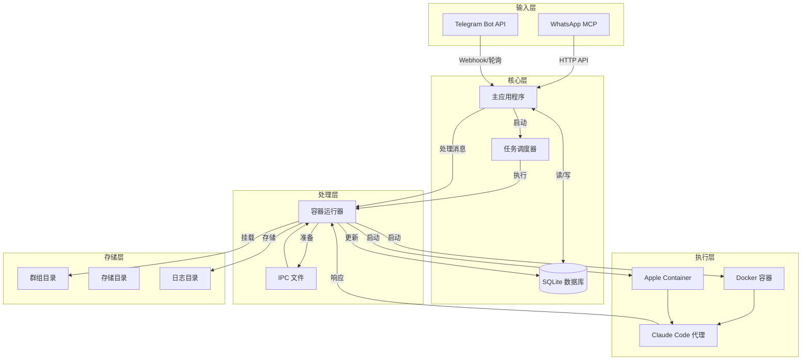
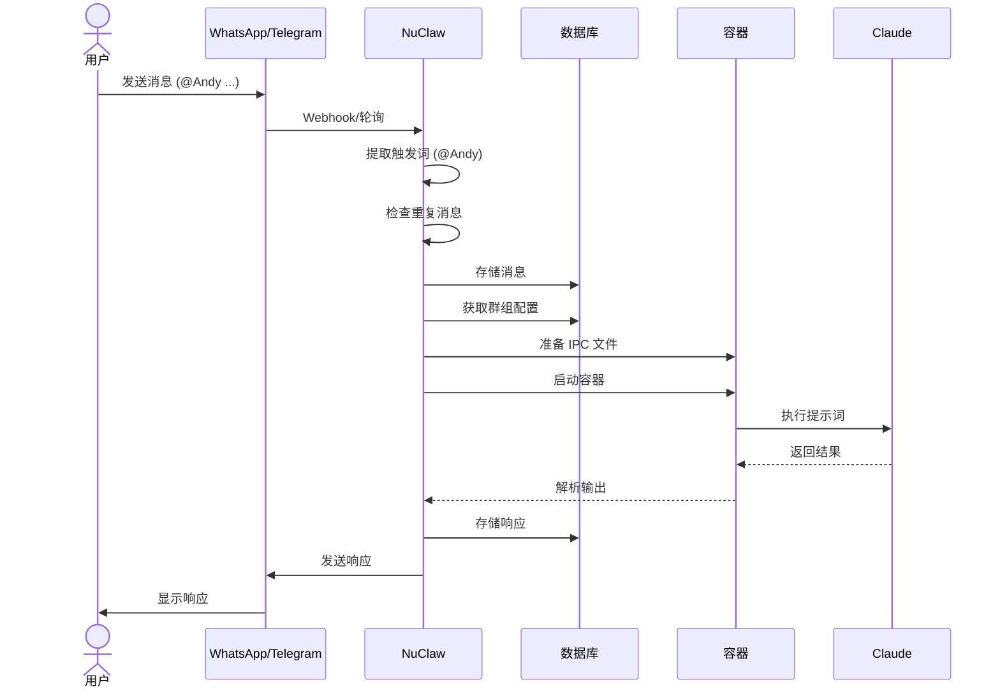
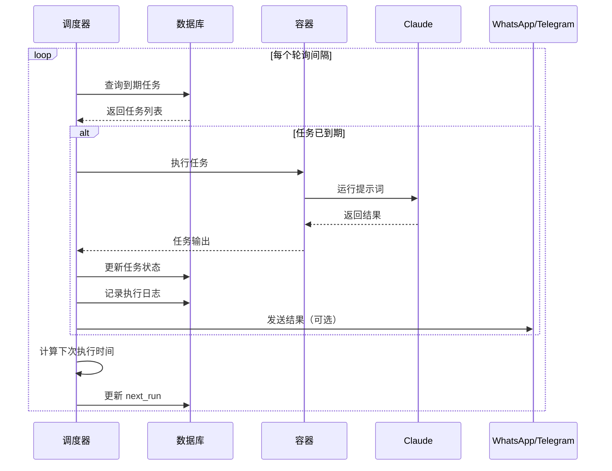

<div align="center">
  
</div>

# NuClaw - 个人 Claude 助手

[](https://www.rust-lang.org)
[](LICENSE)
[](https://github.com/gyc567/nuclaw/actions)
[](docs/TEST_REPORT.md)

一个运行在隔离容器中的个人 Claude 助手。

[English](README.md) | 简体中文

## 为什么选择 Rust?

- **性能** - 更快的启动速度和更低的内存占用
- **安全性** - 内存安全和线程安全保证
- **并发性** - 更好的异步 I/O 处理能力

## 功能特性

- **WhatsApp 消息** - 通过手机向 Claude 发送消息
- **Telegram 消息** - 通过 Telegram 向 Claude 发送消息
- **群组隔离上下文** - 每个群组拥有独立的内存和文件系统
- **容器隔离** - 代理在 Docker 或 Apple Container 中运行
- **定时任务** - 支持 Cron 表达式的周期性任务
- **挂载白名单** - 安全的额外挂载验证机制

## 系统架构

```
WhatsApp / Telegram → SQLite → 调度器 → 容器 (Claude Agent SDK) → 响应
```

### 系统架构图



### 消息流程



### 定时任务流程



### 核心组件

- `src/main.rs` - 应用程序入口
- `src/whatsapp.rs` - WhatsApp 连接（通过 MCP）
- `src/telegram.rs` - Telegram Bot API 连接
- `src/container_runner.rs` - 容器管理
- `src/task_scheduler.rs` - 定时任务执行
- `src/db.rs` - SQLite 数据库操作
- `src/config.rs` - 配置管理

## 系统要求

- Rust 1.70+
- Docker 或 Apple Container
- Node.js（用于代理执行）
- Claude Code 订阅

## 一键安装

### Linux/macOS

```bash
# 运行部署脚本
curl -sSL https://raw.githubusercontent.com/gyc567/nuclaw/main/deploy.sh | bash
```

### 本地安装

```bash
# 克隆并运行部署
git clone https://github.com/gyc567/nuclaw.git
cd nuclaw
chmod +x deploy.sh
./deploy.sh
```

脚本将执行以下步骤：
1. 检测操作系统
2. 安装 Rust/Cargo（如需要）
3. 安装系统依赖（sqlite3）
4. Release 模式构建项目
5. 运行所有测试
6. 验证安装

## 手动安装

```bash
# 从源码构建
git clone https://github.com/gyc567/nuclaw.git
cd nuclaw

# 创建目录
mkdir -p store data groups logs

# 构建
cargo build --release

# 验证
./target/release/nuclaw --help
```

## 快速开始

```bash
# 构建
cargo build --release

# 运行 WhatsApp 认证
cargo run -- auth

# 启动服务
cargo run
```

## 配置

### 核心环境变量

| 变量 | 默认值 | 说明 |
|------|--------|------|
| `ASSISTANT_NAME` | Andy | 触发词（@提及） |
| `CONTAINER_TIMEOUT` | 300000 | 代理执行超时（毫秒） |
| `TZ` | UTC | 定时任务时区 |
| `CONTAINER_IMAGE` | anthropic/claude-code:latest | Docker 镜像 |

### WhatsApp 配置

| 变量 | 说明 |
|------|------|
| `WHATSAPP_MCP_URL` | WhatsApp MCP 服务器 URL（必需） |

### Telegram 配置

| 变量 | 默认值 | 说明 |
|------|--------|------|
| `TELEGRAM_BOT_TOKEN` | - | BotFather 令牌（必需） |
| `TELEGRAM_WEBHOOK_URL` | - | Webhook URL（可选） |
| `TELEGRAM_WEBHOOK_PATH` | telegram-webhook | Webhook 路径 |
| `TELEGRAM_DM_POLICY` | pairing | DM 策略: pairing/allowlist/open/disabled |
| `TELEGRAM_GROUP_POLICY` | allowlist | 群组策略: open/allowlist/disabled |
| `TELEGRAM_TEXT_CHUNK_LIMIT` | 4000 | 最大文本分块大小 |
| `TELEGRAM_WHITELIST_GROUPS` | - | 逗号分隔的群组 ID |

## 挂载白名单

额外的挂载配置在 `~/.config/nuclaw/mount-allowlist.json`：

```json
{
  "allowedRoots": [
    {
      "path": "~/projects",
      "allowReadWrite": true,
      "description": "开发工程项目"
    }
  ],
  "blockedPatterns": ["password", "secret"],
  "nonMainReadOnly": true
}
```

## Telegram 设置

### 第一步：创建机器人

1. 打开 Telegram 并搜索 @BotFather
2. 发送 `/newbot` 创建新机器人
3. 按照说明获取机器人令牌

### 第二步：配置环境变量

```bash
export TELEGRAM_BOT_TOKEN=your_bot_token_here
export TELEGRAM_WEBHOOK_URL=https://your-domain.com  # 可选，用于 Webhook 模式
```

### 第三步：运行机器人

```bash
# Telegram 模式运行
./target/release/nuclaw --telegram
```

### DM 策略选项

- **pairing** - 用户必须使用配对码（默认）
- **allowlist** - 仅白名单用户可交互
- **open** - 任何人都可以交互
- **disabled** - 完全禁用 DM

### 群组策略选项

- **open** - 任何群组都可使用机器人
- **allowlist** - 仅白名单群组可使用机器人
- **disabled** - 禁用群组功能

## WhatsApp 设置

```bash
# 配置 WhatsApp MCP 服务器 URL
export WHATSAPP_MCP_URL=http://localhost:3000

# 运行认证流程
./target/release/nuclaw --auth

# 启动 WhatsApp 机器人
./target/release/nuclaw --whatsapp
```

## 开发

```bash
# 调试日志运行
LOG_LEVEL=debug cargo run

# 运行测试
cargo test

# 代码检查
cargo clippy
```

## 项目结构

```
nuclaw/
├── src/              # 源代码
├── docs/             # 文档和报告
│   ├── TEST_REPORT.md
│   ├── DEPLOY_TEST_REPORT.md
│   └── plans/        # 路线图和计划
├── store/            # 数据库存储
├── data/             # 应用数据
├── groups/           # 群组上下文
└── logs/             # 容器日志
```

## 贡献指南

我们欢迎贡献！详情请参阅 [CONTRIBUTING.md](CONTRIBUTING.md)。

## 路线图

请参阅 [ROADMAP.md](ROADMAP.md) 了解即将推出的功能和计划。

## 文档

- [测试报告](docs/TEST_REPORT.md) - 详细测试结果
- [部署测试报告](docs/DEPLOY_TEST_REPORT.md) - 部署验证

## 许可证

MIT
